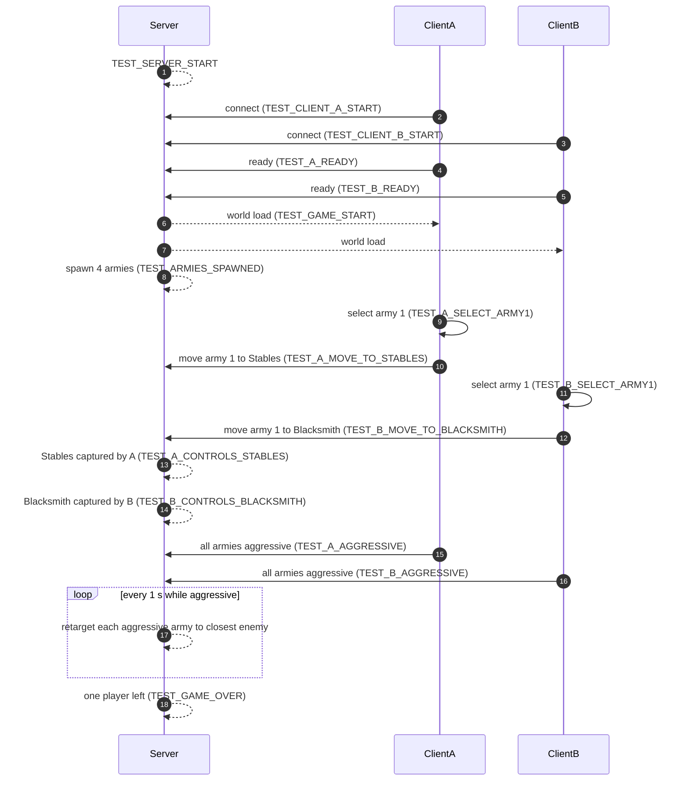

# Automated RTS — Godot 4.6

A minimal multiplayer RTS where two players each control **two armies** on a tilted-3D arena. Each army has 10 soldiers in a formation. Players select armies, move them, and capture two control points (**Stables** and **Blacksmith**) that produce horses and spears. Armies have a **stance**: `defensive` (only moves when ordered) or `aggressive` (the server retargets the army to its closest enemy every second). You win when every one of your opponent's armies has routed.


## Agent-Driven Development

The game can be played by humans, but it is also fully **automatable** so an AI agent (e.g. Cursor Agent) can verify that everything works end to end without a human in the loop. A dedicated server plus two client processes are launched; the two clients are driven by a `MockPlayer` that reads a scripted test from `tests.json` and performs each action in order. Everything relevant is printed to log files with unique `TEST_*` markers, so a verifier script can assert the run succeeded.

| File | Purpose |
|------|---------|
| `prompts.txt` | Master instructions for the agent. |
| `game.md` | Game design document. |
| `tests.json` | Single source of truth for the automated test — every event to verify, every action the MockPlayer must perform, and extra standalone headless checks. |
| `skills.md` | Shell commands for starting/stopping server + clients and collecting logs. |
| `run_test.sh` / `verify_test_logs.sh` | Start the match and then verify the run against `tests.json`. |

### Test format (`tests.json`)

```json
{
  "events": [
    {"description": "...", "marker": "TEST_XXX", "logs": ["server.log"]},
    {"description": "...", "marker": "TEST_YYY", "logs": ["client_A.log"],
     "action": {"player": "A", "type": "select_army", "army_index": 0}}
  ],
  "other_tests": [
    {"description_of_test": "...", "implementation": "<shell command>"}
  ]
}
```

- Each `events[]` entry must have a `marker` that eventually shows up in every log file listed in `logs`.
- Events with an `action` block are **executed by the MockPlayer** on the client whose `player` name matches; events without `action` are purely log-checked (they depend only on server/game behavior).
- Each `other_tests[]` entry is an arbitrary shell command; the verifier runs it and requires exit code 0.

Supported MockPlayer action types:
- `press_ready` — click the Lobby Ready button.
- `select_army` (`army_index`) — select one of the player's armies.
- `move_army_to_cp` (`army_index`, `cp_id`) — send the selected army to `Stables` or `Blacksmith`.
- `set_all_aggressive` (optional `wait_for_controls_cp`) — wait (polled) until the player controls the given CP, then flip all that player's armies to `aggressive`.

### Event sequence



## Requirements

- **Godot 4.6.x** (standalone binary). Examples use `godot`; if `godot` is not in PATH, set `GODOT_BIN=/path/to/Godot_v4.6.1-stable_linux.x86_64`.
- `python3` (used by `verify_test_logs.sh` to parse `tests.json`).

## Running the automated test

```bash
./run_test.sh                  # start server + two auto-test clients (MockPlayer)
# wait until server.log contains TEST_GAME_OVER (~60–180s)
./verify_test_logs.sh          # check every tests.json marker + run other_tests
```

`./run_test.sh --no_test` launches two human-playable clients instead (no MockPlayer).

## How to test manually

### 1. Start the server

```bash
godot --headless --path . -- --server
```

Server listens on port 8910 and prints `TEST_SERVER_START: Dedicated server started on port 8910`.

### 2. Start a client

```bash
godot --rendering-driver opengl3 --path . -- --client --name=A
```

By default the client connects to localhost. Override with `--host=IP` or `GODOT_SERVER_HOST=IP`.

**In game:**
- **Left-click** an army to select it (yours only). Drag with LMB for a marquee selection.
- **Right-click** to move the selected army/armies (drag RMB for a line formation).
- **Arrow keys** or **Q / E** to rotate the selected army.

### 3. Stop everything (leaves the Godot editor alone)

```bash
pkill -f -- '[g]odot.*-- --server' || true
pkill -f -- '[g]odot.*-- --client' || true
```

## Logging

`./run_test.sh` writes:

```
logs/server.log
logs/client_A.log
logs/client_B.log
```

Marker overview:

```bash
grep "TEST_" logs/server.log logs/client_A.log logs/client_B.log
```

## Architecture

- Dedicated **headless** server (authoritative for movement, combat, capture points, resources, and the aggressive-seek logic) and two **3D** clients on port 8910.
- Map is `1280 × 720` on XZ with terrain ground collision; 3D camera pitches from bird's-eye to near-horizontal as you zoom in.
- `Army3D` has a `stance` field; when `aggressive` the server retargets the army to its closest enemy army every second (`AGGRESSIVE_TICK_INTERVAL` in `World.gd`).

## Remote debugging

Open the project in the Godot editor, enable **Debug → Keep Debug Server Open** (default `tcp://127.0.0.1:6007`), then:

```bash
./run_test.sh --remote-debug
./run_test.sh --remote-debug --server-window   # also give the server a visible window
GODOT_REMOTE_DEBUG=tcp://127.0.0.1:6007 ./run_test.sh
```

Use **Debugger → session** and **Scene → Remote** in the editor to inspect any of the three live processes.
