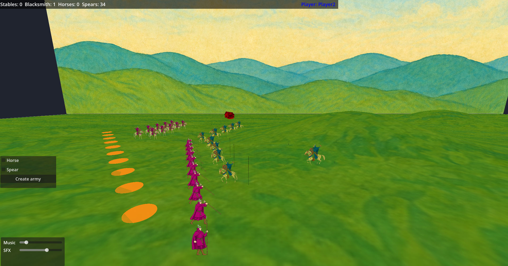
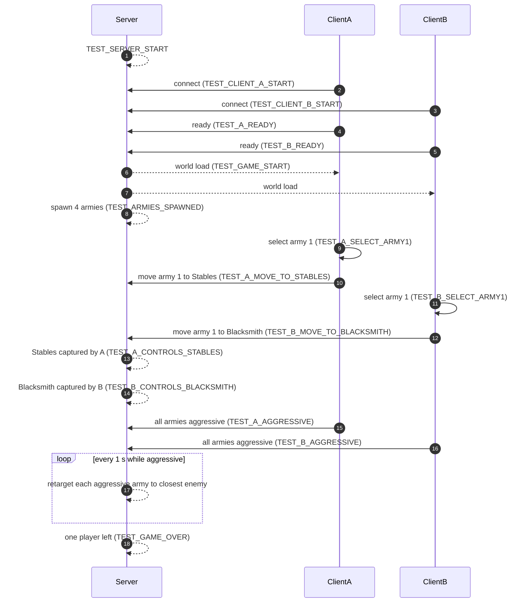

# Automated RTS — Godot 4.6

A minimal multiplayer RTS where players each start with control of **two armies** on a tilted-3D arena. Each army has 10 soldiers in a formation. Players select armies, move them, and capture control points (**Stables**, **Blacksmith**, **Village**, **Archery**) that produce horses, spears, villagers, and bows. New armies require villagers plus optional equipment. You win when every one of your opponent's armies has routed.





## Agent-Driven Development

The game can be played by humans, but it is also fully **automatable** so an AI agent (e.g. Cursor Agent) can verify that everything works end to end without a human in the loop. A dedicated server plus two client processes are launched; the two clients are driven by a `MockPlayer` that reads a scripted test from `tests.json` and performs each action in order. Everything relevant is printed to log files with unique `TEST_*` markers, so a verifier script can assert the run succeeded.

| File | Purpose |
|------|---------|
| `prompts.txt` | Master instructions for the agent. |
| `game.md` | Game design document. |
| `tests.json` | Single source of truth for the automated test — every event to verify, every action the MockPlayer must perform, and extra standalone headless checks. |
| `maps/map_S.json`, `maps/map_L.json`, `maps/map_XL.json` | Map definitions (size, terrain, capture points, player starts, dragons). Selected via `--map=S|L|XL` (default S). |
| `skills.md` | Shell commands for starting/stopping server + clients and collecting logs. |
| `run_test.sh` / `verify_test_logs.sh` | Start the match and then verify the run against `tests.json`. |

### Test format (`tests.json`)

```json
{
  "events": [
    {"description": "...", "marker": "TEST_XXX", "logs": ["server.log"]},
    {"description": "...", "marker": "TEST_YYY", "logs": ["client_A.log"],
     "action": {"player": "A", "type": "select_army", "army_index": 0}}
  ],
  "other_tests": [
    {"description_of_test": "...", "implementation": "<shell command>"}
  ]
}
```

- Each `events[]` entry must have a `marker` that eventually shows up in every log file listed in `logs`.
- Events with an `action` block are **executed by the MockPlayer** on the client whose `player` name matches; events without `action` are purely log-checked (they depend only on server/game behavior).
- Each `other_tests[]` entry is an arbitrary shell command; the verifier runs it and requires exit code 0.

Supported MockPlayer action types:
- `press_ready` — click the Lobby Ready button.
- `select_army` (`army_index`) — select one of the player's armies.
- `move_army_to_cp` (`army_index`, `cp_id`) — send the selected army to `Stables` or `Blacksmith`.
- `set_all_aggressive` (optional `wait_for_controls_cp`) — wait (polled) until the player controls the given CP, then flip all that player's armies to `aggressive`.

### Map sizes (`maps/map_*.json`)

Maps are selected at launch with `--map=S|L|XL` (default **S**). [`MapConfig.gd`](MapConfig.gd) loads `res://maps/map_{size}.json` on startup (server and clients must use the same flag).

| Map | Size | Armies per player | Capture points | Dragons |
|-----|------|-------------------|----------------|---------|
| **S** | 1280×720 | 2 (spear + horse) | 1 Stables, 1 Blacksmith, 1 Village | 1 (center) |
| **L** | 2560×1440 | 1 club army | 2 Stables, 2 Blacksmith, 3 Villages, 2 Archeries | none |
| **XL** | 3840×2160 | 1 club army | 3 Stables, 3 Blacksmith, 3 Villages, 2 Archeries | 2 (guarding central CPs) |

```bash
./run_test.sh              # default map S
./run_test.sh --map L
./run_test.sh --map XL --no_test
```

The arena is described entirely by the chosen map JSON. This is the single place to change map size, capture-point locations, or player starting positions.

```json
{
  "name": "S",
  "size": {"width": 1280, "height": 720},
  "terrain": {"type": "hills", "features": []},
  "capture_points": [
    {"id": "Stables", "type": "Stables", "x": 499.2, "y": 201.6},
    {"id": "Blacksmith", "type": "Blacksmith", "x": 780.8, "y": 496.8},
    {"id": "Village", "type": "Village", "x": 640.0, "y": 580.0}
  ],
  "player_starts": [
    {"slot": 0, "corner": "NW", "armies": [{"x": 199.68, "y": 180.0, "direction": 0.0, "spear": true}, ...]},
    {"slot": 1, "corner": "SE", "armies": [...]},
    {"slot": 2, "corner": "NE", "armies": [...]},
    {"slot": 3, "corner": "SW", "armies": [...]}
  ]
}
```

- `size` — play-area width (X) and height (Z in 3D). All camera and movement clamping uses these.
- `terrain.type` / `terrain.features` — hills use Gaussian bumps; features scale with map size.
- `capture_points[]` — capturable objectives; types: `Stables`, `Blacksmith`, `Village`, `Archery`. IDs `Stables` and `Blacksmith` are used by the auto-test on all map sizes.
- `player_starts[]` — four corner slots (NW/SE/NE/SW). Join order assigns slot 0, 1, … Each slot lists armies with `{x, y, direction}`; optional `horse`/`spear`/`bow` for equipment.
- `neutral_dragon` (S) or `neutral_dragons[]` (XL) — optional map guardians.

`MockPlayer` never opens map JSON; it asks the live game state (armies and capture-point nodes received from the server) for anything it needs. That way a single JSON edit drives server, client rendering, and the bot simultaneously.

### Event sequence


```mermaid
sequenceDiagram
    autonumber
    participant Srv as Server
    participant A as ClientA
    participant B as ClientB
    Srv-->>Srv: TEST_SERVER_START
    A->>Srv: connect (TEST_CLIENT_A_START)
    B->>Srv: connect (TEST_CLIENT_B_START)
    A->>Srv: ready (TEST_A_READY)
    B->>Srv: ready (TEST_B_READY)
    Srv-->>A: world load (TEST_GAME_START)
    Srv-->>B: world load
    Srv-->>Srv: spawn 4 armies (TEST_ARMIES_SPAWNED)
    A->>A: select army 1 (TEST_A_SELECT_ARMY1)
    A->>Srv: move army 1 to Stables (TEST_A_MOVE_TO_STABLES)
    B->>B: select army 1 (TEST_B_SELECT_ARMY1)
    B->>Srv: move army 1 to Blacksmith (TEST_B_MOVE_TO_BLACKSMITH)
    Srv-->>Srv: Stables captured by A (TEST_A_CONTROLS_STABLES)
    Srv-->>Srv: Blacksmith captured by B (TEST_B_CONTROLS_BLACKSMITH)
    A->>Srv: all armies aggressive (TEST_A_AGGRESSIVE)
    B->>Srv: all armies aggressive (TEST_B_AGGRESSIVE)
    loop every 1 s while aggressive
        Srv-->>Srv: retarget each aggressive army to closest enemy
    end
    Srv-->>Srv: one player left (TEST_GAME_OVER)
```

## Requirements

- **Godot 4.6.x** (standalone binary). Examples use `godot`; if `godot` is not in PATH, set `GODOT_BIN=/path/to/Godot_v4.6.1-stable_linux.x86_64`.
- `python3` (used by `verify_test_logs.sh` to parse `tests.json`).

## Running the automated test

```bash
./run_test.sh                  # start server + two auto-test clients (map S)
./run_test.sh --map L          # large map (2560×1440)
./run_test.sh --map XL         # extra-large map (3840×2160)
# wait until server.log contains TEST_GAME_OVER (~60–180s)
./verify_test_logs.sh          # check every tests.json marker + run other_tests
```

`./run_test.sh --no_test` launches two human-playable clients instead (no MockPlayer).

## Play on Windows (join a remote game)

Foolproof three steps for Windows players connecting to a remote dedicated server
(for example one started with Hetzner `run_rts_remote_ai_local_human.py`):

1. **Clone** this repository (or pull the latest).
2. **Once:** double-click / run `install_godot_windows.bat`  
   This downloads Godot **4.6.1** into `tools\godot\` (no PATH setup needed).
3. **Each session:** run `connect_remote.bat SERVER_IP`  
   Use the IP printed by the host. In the lobby, press **Ready**.

Optional player name: `connect_remote.bat SERVER_IP MyName`

You only need outbound UDP to port **8910**. No port forwarding on your PC.

PowerShell equivalents: `.\install_godot_windows.ps1` and
`.\connect_remote.ps1 -ServerIp SERVER_IP`.

## How to test manually

### 1. Start the server

```bash
godot --headless --path . -- --server
```

Server listens on port 8910 and prints `TEST_SERVER_START: Dedicated server started on port 8910`.

### 2. Start a client

```bash
godot --rendering-driver opengl3 --path . -- --client --name=A
```

By default the client connects to localhost. Override with `--host=IP` or `GODOT_SERVER_HOST=IP`.

**In game:**
- **Left-click** an army to select it (yours only). Drag with LMB for a marquee selection.
- **Right-click** to move the selected army/armies (drag RMB for a line formation).
- **Arrow keys** or **Q / E** to rotate the selected army.

### 3. Stop everything (leaves the Godot editor alone)

```bash
pkill -f -- '[g]odot.*-- --server' || true
pkill -f -- '[g]odot.*-- --client' || true
```

## Logging

`./run_test.sh` writes:

```
logs/server.log
logs/client_A.log
logs/client_B.log
```

Marker overview:

```bash
grep "TEST_" logs/server.log logs/client_A.log logs/client_B.log
```

## Architecture

- Dedicated **headless** server (authoritative for movement, combat, capture points, resources, and the aggressive-seek logic) and two **3D** clients on port 8910.
- Map is `1280 × 720` on XZ with terrain ground collision; 3D camera pitches from bird's-eye to near-horizontal as you zoom in.
- Unit movement: enemies block each other; friendlies pass through. See `game.md` Physics / collision to toggle pass-through.
- `Army3D` has a `stance` field; when `aggressive` the server retargets the army to its closest enemy army every second (`AGGRESSIVE_TICK_INTERVAL` in `World.gd`).

## Remote debugging

Open the project in the Godot editor, enable **Debug → Keep Debug Server Open** (default `tcp://127.0.0.1:6007`), then:

```bash
./run_test.sh --remote-debug
./run_test.sh --remote-debug --server-window   # also give the server a visible window
GODOT_REMOTE_DEBUG=tcp://127.0.0.1:6007 ./run_test.sh
```

Use **Debugger → session** and **Scene → Remote** in the editor to inspect any of the three live processes.
