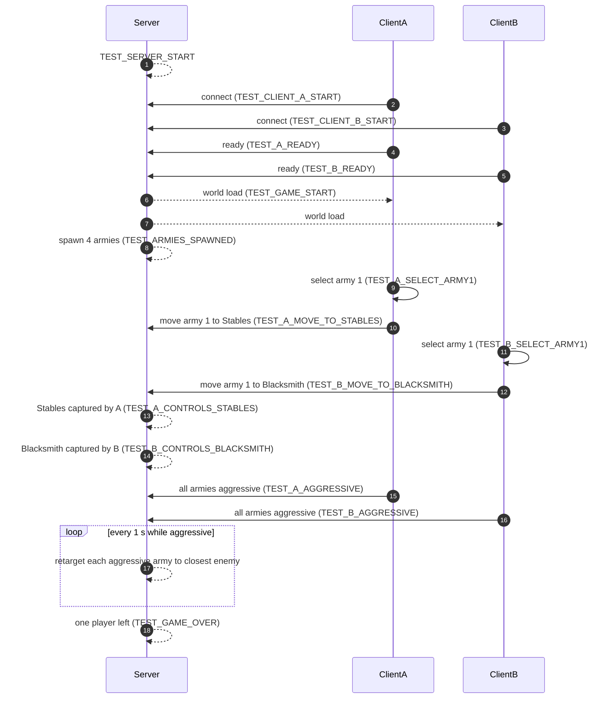

# Documentation

Player install and run instructions live in the root [README.md](../README.md). This file is the rest of the project notes: automated tests, maps, architecture, map editor, and design specs.

---

## Former README (tests, maps, architecture)

## Agent-Driven Development

The game can be played by humans, but it is also fully **automatable** so an AI agent (e.g. Cursor Agent) can verify that everything works end to end without a human in the loop. A dedicated server plus two client processes are launched; the two clients are driven by a `MockPlayer` that reads a scripted test from `tests.json` and performs each action in order. Everything relevant is printed to log files with unique `TEST_*` markers, so a verifier script can assert the run succeeded.

| File | Purpose |
|------|---------|
| `documentation/documentation.md` (this file) | Design specs, architecture, map editor, and agent commands. |
| `game_assets/tests.json` | Single source of truth for the automated test — every event to verify, every action the MockPlayer must perform, and extra standalone headless checks. |
| `game_assets/maps/map_S.json`, `map_L.json`, `map_XL.json` | Map definitions (size, terrain, capture points, player starts, dragons). Selected via `--map=S|L|XL` (default S). |
| `run_test.sh` / `game_assets/verify_test_logs.sh` | Start the match (repo root) and then verify the run against `tests.json`. Logs stay in repo-root `logs/`. |

### Test format (`tests.json`)

```json
{
  "events": [
    {"description": "...", "marker": "TEST_XXX", "logs": ["server.log"]},
    {"description": "...", "marker": "TEST_YYY", "logs": ["client_A.log"],
     "action": {"player": "A", "type": "select_army", "army_index": 0}}
  ],
  "other_tests": [
    {"description_of_test": "...", "implementation": "<shell command>"}
  ]
}
```

- Each `events[]` entry must have a `marker` that eventually shows up in every log file listed in `logs`.
- Events with an `action` block are **executed by the MockPlayer** on the client whose `player` name matches; events without `action` are purely log-checked (they depend only on server/game behavior).
- Each `other_tests[]` entry is an arbitrary shell command; the verifier runs it and requires exit code 0.

Supported MockPlayer action types:
- `press_ready` — click the Lobby Ready button.
- `select_army` (`army_index`) — select one of the player's armies.
- `move_army_to_cp` (`army_index`, `cp_id`) — send the selected army to `Stables` or `Blacksmith`.
- `set_all_aggressive` (optional `wait_for_controls_cp`) — wait (polled) until the player controls the given CP, then flip all that player's armies to `aggressive`.

### Map sizes (`maps/map_*.json`)

Maps are selected at launch with `--map=S|L|XL` (default **S**). [`MapConfig.gd`](../game_assets/MapConfig.gd) loads `res://maps/map_{size}.json` on startup (server and clients must use the same flag).

| Map | Size | Armies per player | Capture points | Dragons |
|-----|------|-------------------|----------------|---------|
| **S** | 1280×720 | 2 (spear + horse) | 1 Stables, 1 Blacksmith, 1 Village | 1 (center) |
| **L** | 2560×1440 | 1 club army | 2 Stables, 2 Blacksmith, 3 Villages, 2 Archeries | none |
| **XL** | 3840×2160 | 2 (spear + horse) | 3 Stables, 3 Blacksmith, 3 Villages, 2 Archeries | none (mountainous) |

```bash
./run_test.sh              # default map S
./run_test.sh --map L
./run_test.sh --map XL --no_test
```

The arena is described entirely by the chosen map JSON. This is the single place to change map size, capture-point locations, player starting positions or army sizes (`"soldiers": N` per army entry, 10–200; default 10). For stress runs `./run_test.sh --stress-units=1000` adds extra armies per player until that many soldiers exist (`./run_stress.sh` wraps this and checks the perf markers).

```json
{
  "name": "S",
  "size": {"width": 1280, "height": 720},
  "terrain": {"type": "hills", "features": []},
  "capture_points": [
    {"id": "Stables", "type": "Stables", "x": 499.2, "y": 201.6},
    {"id": "Blacksmith", "type": "Blacksmith", "x": 780.8, "y": 496.8},
    {"id": "Village", "type": "Village", "x": 640.0, "y": 580.0}
  ],
  "player_starts": [
    {"slot": 0, "corner": "NW", "armies": [{"x": 199.68, "y": 180.0, "direction": 0.0, "spear": true}, ...]},
    {"slot": 1, "corner": "SE", "armies": [...]},
    {"slot": 2, "corner": "NE", "armies": [...]},
    {"slot": 3, "corner": "SW", "armies": [...]}
  ]
}
```

- `size` — play-area width (X) and height (Z in 3D). All camera and movement clamping uses these.
- `terrain.type` / `terrain.features` — analytical terrain built at startup. Height at any point is the **max** over positive features (`hill`, `ridge`, `spline_ridge`, `plateau`), then **valleys** carve downward (clamped to 0). Feature schemas:
  - **hill** — radial Gaussian bump: `{type, x, y, base_width, height}` (`y` is map Z).
  - **ridge** — straight Gaussian spine: `{type, x1, y1, x2, y2, width, height}`.
  - **spline_ridge** — curved Gaussian spine through control points: `{type, points: [{x, y}, ...], width, height}` (≥2 points; Catmull-Rom spline).
  - **plateau** — flat top with smooth rim: `{type, x, y, radius, falloff, height}`.
  - **plateau_polygon** — flat polygon top with smooth exterior falloff: `{type, points: [{x, y}, ...], height, falloff}` (≥3 points).
  - **valley** — radial carve (subtract from positive height): `{type, x, y, base_width, depth}`.
  - **valley_polygon** — smooth polygon depression (inverted hill): `{type, points: [{x, y}, ...], depth, falloff}` (≥3 points).
- `capture_points[]` — capturable objectives; types: `Stables`, `Blacksmith`, `Village`, `Archery`. IDs `Stables` and `Blacksmith` are used by the auto-test on all map sizes.
- `player_starts[]` — four corner slots (NW/SE/NE/SW). Join order assigns slot 0, 1, … Each slot lists armies with `{x, y, direction}`; optional `horse`/`spear`/`bow` for equipment.
- `lighting` (optional) — directional sun applied at runtime after terrain is built. [`World.gd`](../game_assets/World.gd) scales sun orbit and shadow distance from map size and final max terrain height.
  - `sun_azimuth_deg` — compass bearing where the sun sits: **0 = north (−Z)**, **90 = east (+X)**, **180 = south (+Z)**. Default **275**.
  - `sun_elevation_deg` — degrees above the horizon. Default **0** (low horizontal sun).
  - `energy` — directional light strength (vertex height tint remains the primary summit signal). Default **0.12**.
  - `color` — RGB array, e.g. `[1.0, 0.98, 0.95]`.
  - `shadow_max_distance` — `null` = auto (`max(800, map_diagonal × 0.35 + max_terrain_height × 1.5)`); or a fixed number.
- `walkability` (optional) — which terrain cells units may enter; built after terrain and lakes at startup.
  - `max_slope_deg` — steeper slopes are blocked (default **45**). Blocked cells use `steep_hills.png` on the ground shader; lakes are always blocked.
- `neutral_dragon` (S) or `neutral_dragons[]` (optional on other maps) — optional map guardians.

`MockPlayer` never opens map JSON; it asks the live game state (armies and capture-point nodes received from the server) for anything it needs. That way a single JSON edit drives server, client rendering, and the bot simultaneously.

### Event sequence



## Requirements

- **Godot 4.6.x**. From the repo root, `./install_godot_linux.sh` (or Windows `install_godot_windows.bat`) downloads 4.6.1 into `tools/godot/`. Launch scripts use that binary if present; otherwise `godot` on PATH or `GODOT_BIN`.
- `python3` (used by `verify_test_logs.sh` to parse `tests.json`).

## Running the automated test

```bash
./run_test.sh                  # start server + two auto-test clients (map S)
./run_test.sh --map L          # large map (2560×1440)
./run_test.sh --map XL         # extra-large map (3840×2160)
# wait until server.log contains TEST_GAME_OVER (~60–180s)
./game_assets/verify_test_logs.sh          # check every tests.json marker + run other_tests
```

`./run_test.sh --no_test` launches two human-playable clients instead (no MockPlayer).

## Play on Windows (join a remote game)

Foolproof three steps for Windows players connecting to a remote dedicated server
(for example one started with Hetzner `run_rts_remote_ai_local_human.py`):

1. **Clone** this repository (or pull the latest).
2. **Once:** double-click / run `install_godot_windows.bat`  
   This downloads Godot **4.6.1** into `tools\godot\` (no PATH setup needed).
3. **Each session:** run `connect_remote.bat SERVER_IP`  
   Use the IP printed by the host. In the lobby, press **Ready**.

Optional player name: `connect_remote.bat SERVER_IP MyName`

You only need outbound UDP to port **8910**. No port forwarding on your PC.

PowerShell equivalents: `.\install_godot_windows.ps1` and
`.\connect_remote.ps1 -ServerIp SERVER_IP`.

## How to test manually

### 1. Start the server

```bash
godot --headless --path game_assets -- --server
```

Server listens on port 8910 and prints `TEST_SERVER_START: Dedicated server started on port 8910`.

### 2. Start a client

```bash
godot --rendering-driver opengl3 --path game_assets -- --client --name=A
```

By default the client connects to localhost. Override with `--host=IP` or `GODOT_SERVER_HOST=IP`.

**In game:**
- **Left-click** an army to select it (yours only). Drag with LMB for a marquee selection.
- **Right-click** to move the selected army/armies (drag RMB for a line formation).
- **Arrow keys** or **Q / E** to rotate the selected army.

### 3. Stop everything (leaves the Godot editor alone)

```bash
pkill -f -- '[g]odot.*-- --server' || true
pkill -f -- '[g]odot.*-- --client' || true
```

## Logging

`./run_test.sh` writes:

```
logs/server.log
logs/client_A.log
logs/client_B.log
```

Marker overview:

```bash
grep "TEST_" logs/server.log logs/client_A.log logs/client_B.log
```

## Architecture

- Dedicated **headless** server (authoritative for combat, deaths, routs, capture points, resources and the aggressive-seek logic) and two **3D** clients on port 8910.
- **Data-oriented unit simulation** (`game_assets/sim/`): units are integer ids into `PackedFloat32Array`/`PackedByteArray` columns in `UnitSim.gd`; there are no unit nodes, no `CharacterBody3D` and no physics bodies for units anywhere. The sim runs at a fixed **20 Hz** on server and clients from an accumulator in `World._physics_process`.
- **Formation-level orders**: a `FormationController` per army owns the order, one A* path per order and an anchor that advances along it; soldiers steer to slots (anchor + rotated offset). Orders are tiny reliable RPCs; the server validates, stamps and echoes them to every client, which then runs the same movement sim locally.
- **Snapshots are corrections, not movement**: the server sends packed 8-byte unit records (`NetSync.gd`) on `unreliable_ordered`, prioritising units that changed; clients blend small errors and snap only on real desync.
- **GPU instancing**: clients draw all units with one `MultiMeshInstance3D` per (team colour, unit type) (`UnitRenderer.gd` + `shaders/unit_billboard.gdshader`); the shader does billboarding, spritesheet frame selection, flip, selection tint and interpolation between sim ticks. Audio is a 16-player pool parked at army clusters (`UnitAudio.gd`).
- Map sizes S/L/XL (`maps/map_*.json`); terrain height is a bilinear grid lookup (`_terrain_grid_height_at`), never a per-unit raycast. 3D camera pitches from bird's-eye to near-horizontal as you zoom in.
- Design target: 2 players, ~2000–2500 units total. Measured on one laptop running server + 2 clients (XL, 2040 units): server sim tick ≈ 17 ms at a steady 20 Hz, clients ≈ 85 fps, ≈ 33 KB/s server upload. `./run_stress.sh` reproduces this and asserts the thresholds.
- `Army3D` is a thin per-army handle (id, owner, selection, equipment flags, `fc` = its `FormationController`). Aggressive armies with no order are retargeted to the closest enemy army every second (`AGGRESSIVE_TICK_INTERVAL` in `World.gd`).

## Remote debugging

Open the project in the Godot editor, enable **Debug → Keep Debug Server Open** (default `tcp://127.0.0.1:6007`), then:

```bash
./run_test.sh --remote-debug
./run_test.sh --remote-debug --server-window   # also give the server a visible window
GODOT_REMOTE_DEBUG=tcp://127.0.0.1:6007 ./run_test.sh
```

Use **Debugger → session** and **Scene → Remote** in the editor to inspect any of the three live processes.


---

## Game design (`game.md`)

# Project: Minimal RTS Multiplayer (Godot 4.6)

## Architecture
- **Model**: Client-Server (Dedicated Server -- server is never a client).
- **Networking**: High-level Multiplayer API (`ENetMultiplayerPeer`).
- **Authority**: Server-authoritative movement and combat.
- **Port**: 8910 (default). Server binds on `*:8910`, clients connect to `localhost:8910`.

## Game View & Controls
- **Perspective**: 3D, bird's-eye to near-horizontal camera over billboarded sprites.
- **Navigation**: grid `AStarGrid2D` walkability (water + steep slopes) in [`WalkabilityGrid.gd`](../game_assets/WalkabilityGrid.gd); **one A* path per army order**, computed identically on server and clients. Soldiers only get an individual (throttled) path when they are stuck behind an obstacle.
- **Player Controls**:
  - Left-click: Select own army.
  - Right-click: Move selected army to clicked position.
  - Left/Right arrow keys (or Q/E): Rotate selected army facing direction by 15 degrees.
  - Units auto-attack enemies within range (server-driven).

## Player sides
- For 2 players: first connected = **West** (left), second = **East** (right). Drafted armies spawn from the player's side and walk in until fully visible (stop_when_visible).

## Army System (Total War Style)
- On map **S** and **XL**, each player starts with **2 armies** (spear + horse). On **L**, each player starts with **1 club army** (no equipment).
- **Army size is a per-army parameter (10–200 soldiers)**: `soldiers` in the map JSON, a SpinBox in the draft menu, `--stress-units=N` for stress runs (`STRESS_SOLDIERS_PER_ARMY` per extra army). Rows default from the count (`FormationController.default_rows_for`).
- An army has an **anchor position** and a **facing direction** (angle in radians); slot offsets are cached per shape.
- Soldier goals are anchor + rotated slot offset, snapped to the nearest walkable cell; the anchor moves along the army's path at the slowest soldier's speed and slows/pauses while a large share of the army is in melee contact.
- When soldiers die the survivors **repack** once the loss passes `REPACK_FRACTION`, not on every death (stable slot assignment).

## Drafting
- **Draft menu**: Lower-left of screen. Checkboxes **Horse**, **Spear**, and **Bow**, button **Create army**.
- **Cost**: **10 villagers** for every army, plus **10** of each checked equipment type (horse / spear / bow). Player must have enough resources.
- **Created army**: chosen soldier count (default 10), spawns off-screen on the player's side (West/East), walks in and **stops when fully visible**.
- **Unit types** (equipment priority): Horse+Bow → **bauer_horse_archer**; Bow → **bowman**; Horse → **knight**; Spear → **spearman**; none → **clubman**.
- **Equipment effects**: Horse → mounted speed/HP. Spear → higher attack/melee range. Bow / bauer_horse_archer → ranged attack. Starting armies on map S and XL use spear/horse from JSON; L starts with clubmen.

## Capture Points & Resources
- Map **S**: 1 Stables, 1 Blacksmith, 1 Village (3 CPs total). Map **L**: 2 Stables, 2 Blacksmith, 3 Villages, 2 Archeries (9 CPs). Map **XL**: mountainous (3 large peaks + 1 ridge), 3 Stables, 3 Blacksmith, 3 Villages, 2 Archeries (11 CPs), no dragons.
- Capture points start **unowned**.
- A capture point is captured when **only units from a single player** are within its capture radius (120 px). Contested (both players nearby) = no capture change.
- Once captured, each type produces **1** resource every **2 seconds**: **Stables** → horses, **Blacksmith** → spears, **Village** → villagers, **Archery** → bows.
- Capture points can be **taken over** by the opposing player using the same proximity rule.
- Each player starts with **10 horses, 10 spears, 10 bows, and 10 villagers** in inventory (`GameState.resources`).
- Resources are displayed in the top-bar HUD (CP counts + inventory).
- **Seek enemy**: If an army has been at a capture point for **5 seconds** with **no combat** occurring anywhere, the server orders that army to seek and continuously follow the **closest enemy army** (move target is updated every tick so the army follows when the enemy moves). A manual move order (right-click) cancels follow.

## Army orders and stances

Army-level control (select with LMB / marquee). Command bar appears when an army is selected.

| Control | Action |
|---------|--------|
| **Move** (default, `M`) | RMB on ground: move formation. RMB drag: line formation. |
| **Attack-Move** (`G`) | Same as Move but units engage enemies along the way. |
| **Attack** (`A`) | LMB on enemy army or dragon: pursue and attack that target. |
| **Aggressive / Defensive / Hold / Passive** | Stance buttons on command bar. Aggressive with no order auto-chases nearest enemy. |

Behaviour spec: `RTS_Unit_Behaviour_Spec.md`. Move orders are **not** cancelled when attacked. Attack orders lock onto the commanded target. Ranged units (bow, horse archer) can attack while moving.

## Movement, separation and combat (no physics bodies)
- Units have **no collision shapes**. `UnitSim._step_units` does, per unit per tick: slot steering (with catch-up speed when far behind a marching formation), **soft separation** through a counting-sort `SpatialHash` (weak push between friendlies, strong push between hostiles, capped per tick), a **walkability slide** (try full step, then x-only, then z-only), network correction blending, and combat.
- **Combat** is distance based: each unit rescans for a target at 5 Hz (`COMBAT_SCAN_PHASES`), validates it every tick, and attacks on a 1 s cooldown when in range. Melee units on the offensive acquire targets out to `MELEE_ACQUIRE_RADIUS` and walk in. Armies whose broad-phase check (0.5 s round-robin) finds no hostile within reach skip all per-unit scans. Damage, deaths, arrows and routs are only resolved on the authority (server); clients learn them from reliable events.
- **Animation state comes from measured displacement** (`F_MOVING` is set only when a unit actually moved > 15 % of its step), so a unit can never show the walk cycle while standing still.
- Physics layers are still used for the terrain collider (`ground`, layer 2) and mouse picking only.

## Unit Stats (Defaults)
| Stat    | Value |
|---------|-------|
| Speed   | 67    |
| HP      | 100   |
| Attack  | 10    |
| Defense | 2     |
| Range   | 50.0  |

## Lobby
- **Name input field**: Player can enter display name. Pre-filled from `--name=<value>` if provided, otherwise **Unknown Player**. Name is sent to the server when pressing Ready (duplicate names are allowed; army identity uses peer id).
- **Color picker**: Players choose one of 5 colors by clicking a colored box. First player gets the first color preselected; each new player gets the first not-already-used color. Taken colors are greyed out; players can change to any free color. Units in the game use the chosen color.

## Top Bar HUD
- A `CanvasLayer` UI bar at the top of the screen during gameplay.
- **Left**: `Stab/Blk/Vill/Arch` CP counts owned, then `H/S/B/V` inventory (horses, spears, bows, villagers).
- **Right**: `Player: <display name>`.
- Updated every sync tick from the server.

## Rout & Win Condition
- When an army drops below **30%** soldiers alive (3 of 10), it **routs**.
- Routed army's remaining soldiers flee and are removed.
- A player **loses** when **both** of their armies have routed.
- Server declares the other player the winner.

## Scene Structure
| Scene           | Purpose |
|-----------------|---------|
| `Main.tscn`     | Entry point: parses CLI args, creates network peer, switches to Lobby. |
| `Lobby.tscn`    | Shows name input, color picker (5 boxes), connected players, ready states. "Ready" toggle button. |
| `World.tscn`    | 3D arena (ground mesh + terrain collider). Server and clients spawn armies into the sim here. |
| (units)         | No unit scene: units are rows in `sim/UnitSim.gd`, drawn by `sim/UnitRenderer.gd` (MultiMesh). |
| (capture)       | Capture points are pillars + server-side logic in `World.gd` (no separate CP scene). |
| `GameOver.tscn` | Displays winner. Clients auto-disconnect after a delay. |

## Script Files
| Script          | Role |
|-----------------|------|
| `Main.gd`       | Networking setup, scene switching. |
| `Lobby.gd`      | Ready-state RPCs, player list UI. |
| `World.gd`      | Orchestration: order RPCs (validate + echo), sim stepping, snapshots/events, spawning, capture points, selection, camera, rout/win checking. |
| `Army3D.gd`     | Thin per-army handle: id, owner, selection, equipment flags, reference to the sim's `FormationController`. |
| `sim/UnitSim.gd` | Data-oriented unit simulation (SoA arrays): steering, separation, walkability, combat, deaths, routs. Server and clients run the same code; only the authority resolves damage. |
| `sim/FormationController.gd` | Per-army orders (move / attack-move / attack / stances / rotate), slot layout for 10–200 soldiers, one A* path per order, anchor advance and contact pausing. |
| `sim/SpatialHash.gd` | Counting-sort uniform grid over the map; radius / nearest queries for separation, combat, capture points, dragon AI and picking. |
| `sim/NetSync.gd` | Packed 8-byte unit snapshots (<= 1200 B chunks), dirty/idle send scheduling, client reconciliation with per-unit tick check. |
| `sim/UnitRenderer.gd` | GPU-instanced billboards: one MultiMesh per (colour, type), stacked spritesheet textures, per-tick buffer writes, shader-side interpolation. |
| `sim/UnitAudio.gd` | Pooled positional audio (16 cluster players + 6 death one-shots) instead of one player per unit. |
| `GroupFormation.gd` | Line-formation math for RMB drag orders (segments per army, ghost preview positions). |
| `PerfMonitor.gd` | `TEST_PERF_*` markers every 5 s (frame/physics/sim times, sim Hz, fps, memory, bytes/s) and `TEST_SIM_CLIENT` health counters. |
| `TopBar.gd`     | HUD overlay: shows resources and capture point ownership. |
| `GameOver.gd`   | Winner display, disconnect logic. |
| `MockPlayer.gd` | Automated test client (activated by `--auto-test`). |

## Automation Strategy
- **Decoupled Logic**: Every action (Select Army, Ready, Move Army, Rotate) is a standalone function callable by MockPlayer.
- **Agent Entry**: Clients pass `--auto-test` to activate `MockPlayer.gd`.
- **Logging**: Every significant event prints a `TEST_XXX` marker for automated verification.
- **Dedicated Server**: The server process runs headless (`--headless`) and never joins as a player.


---

## Skills and commands (`skills.md`)

# Project Skills & Scripting

All automated-test behaviour is defined in `tests.json`. The MockPlayer reads it and executes the `action`s for its player; `verify_test_logs.sh` scrapes every `events[].marker` and runs every `other_tests[].implementation`.

## [Skill: Install Godot on Windows]
Downloads Godot 4.6.1 into `tools\godot\` so `connect_remote.bat` finds it (no PATH needed).
**Command (cmd / double-click):**
```bat
install_godot_windows.bat
```
**Command (PowerShell):**
```powershell
powershell -ExecutionPolicy Bypass -File .\install_godot_windows.ps1
```

## [Skill: Connect remote client on Windows]
Joins a remote dedicated server as a human player. Requires step above once.
**Command:**
```bat
connect_remote.bat SERVER_IP
connect_remote.bat SERVER_IP MyName
```
**PowerShell:**
```powershell
.\connect_remote.ps1 -ServerIp SERVER_IP
.\connect_remote.ps1 -ServerIp SERVER_IP -Name MyName
```
Then press Ready in the lobby. Uses UDP port 8910 outbound.

## [Skill: Run Server]
Starts the Godot dedicated server in headless mode (no rendering, no local player).
**Command:**
```bash
mkdir -p logs
godot --headless --path game_assets -- --server > logs/server.log 2>&1 & echo $! > logs/server.pid
```

## [Skill: Run Client A]
Starts Client A with the auto-test MockPlayer. Optional: `--host=IP` or env `GODOT_SERVER_HOST` to connect to a remote server (default: localhost).
**Command:**
```bash
godot --rendering-driver opengl3 --path game_assets -- --client --name=A --auto-test > logs/client_A.log 2>&1 & echo $! > logs/client_A.pid
```

## [Skill: Run Client B]
Starts Client B with the auto-test MockPlayer. Optional: `--host=IP` or `GODOT_SERVER_HOST` for a remote server.
**Command:**
```bash
godot --rendering-driver opengl3 --path game_assets -- --client --name=B --auto-test > logs/client_B.log 2>&1 & echo $! > logs/client_B.pid
```

## [Skill: Clean & Kill]
Stops dedicated server / client game processes only (does not kill the Godot editor). Clears old logs.
**Command:**
```bash
pkill -f -- '[g]odot.*-- --server' || true
pkill -f -- 'Godot.*-- --server' || true
pkill -f -- '[g]odot.*-- --client' || true
pkill -f -- 'Godot.*-- --client' || true
rm -rf logs/*.log logs/*.pid
```

## [Skill: Extract Logs]
Search logs for test markers.
**Command:**
```bash
grep "TEST_" logs/server.log logs/client_A.log logs/client_B.log
```

## [Skill: Run Full Test]
Composite: clean, start server, start both auto-test clients.
**Command:**
```bash
./run_test.sh
```
Then wait until `TEST_GAME_OVER` appears in `logs/server.log` (`./game_assets/wait_for_test_end.sh`), and verify:
```bash
./game_assets/verify_test_logs.sh
```

## [Skill: Run Full Test with Remote debugging]
Open the project in the Godot editor and enable **Debug → Keep Debug Server Open**, then from the repo root:
```bash
./run_test.sh --remote-debug
```
Optional: `./run_test.sh --remote-debug --server-window` for a visible server window. Use **Debugger → session** and **Scene → Remote** in the editor to inspect each running process.


---

## Network activity

# Network activity

How this game talks over the network and why it scales to thousands of units. Transport: Godot 4
High-Level Multiplayer API on **ENet**, UDP port **8910**. The dedicated server is authoritative
for combat, deaths, routs, capture points and resources; **movement is simulated on both sides**
from the same order stream and the server only sends compact corrections.

ENet MTU in this Godot build is **1392 bytes** for a single unreliable packet; every unreliable
message below stays under **1200 bytes** by construction (chunking), so nothing fragments.

---

## Mental model

```
Client                                 Server                              Other clients
  |  reliable order (army ids, dest,     |                                       |
  |  facing, seq)  ------------------->  |  validate ownership, stamp seq,       |
  |                                      |  apply to authoritative UnitSim       |
  |  <------ reliable order echo ------- | ------- reliable order echo --------> |
  |  apply to local UnitSim (same code)  |  UnitSim 20 Hz: paths, slots,         |
  |  UnitSim 20 Hz: same movement        |  separation, combat, deaths           |
  |  <--- unreliable_ordered snapshot -- | ---- 8-byte records, <= 1200 B -----> |
  |  reconcile: ignore stale, blend,     |  changed units first, idle ones       |
  |  snap only on real desync            |  every 2 s                            |
  |  <--- reliable batched events ------ | ---- deaths, routs, spawns ---------> |
  |  <--- unreliable arrows/tick ------- |                                       |
```

| Kind | Channel | If it fails |
|------|---------|-------------|
| **Orders and lifecycle** (move / attack / stance / rotate echoes, draft, spawn payloads, deaths, routs, capture/resources, win) | `reliable` | Must arrive. ENet retries; delay is OK, loss is not. |
| **Snapshots** (`_client_snapshot`) | `unreliable_ordered` | A missed chunk is fine: the next one for that unit overwrites. Out-of-order chunks are dropped per unit by sim tick. |
| **Arrow VFX** (`_client_arrows`) | `unreliable` | Purely cosmetic. |

---

## Orders (client -> server -> everyone)

All orders are **formation level**: they carry army ids, not unit goals. Sizes are a few dozen
bytes regardless of army size, and the client does **no** pathfinding work before sending.

| RPC (client -> server) | Payload | Server does | Echo to all clients |
|---|---|---|---|
| `_server_order_move(army_ids, dests, facings, widths, attack_move)` | `Array` of ids + `PackedFloat32Array`s | ownership check, clamp to map, `FormationController.issue_move` per army | `_client_order_move(seq, tick, ...)` |
| `_server_move_army(aid, target)` (MockPlayer / legacy) | id + Vector2 | same as above for one army | `_client_order_move` |
| `_server_armies_order_attack(army_ids, target_army_id, target_unit)` | ids | `issue_attack_army/unit` | `_client_order_attack(seq, tick, ...)` |
| `_server_armies_order_attack_move(army_ids, dest_x, dest_y)` | ids + 2 floats | attack-move | `_client_order_move(..., attack_move=true)` |
| `_server_armies_set_stance(army_ids, stance)` | ids + int | `set_stance` | `_client_sync_army_stance` |
| `_server_rotate_army(aid, delta_angle)` | id + float | rotate formation | `_client_rotate_army(aid, new_line_dir)` |
| `_server_set_all_armies_aggressive()` | none | stance for all of the sender's armies | `_client_sync_army_stance` |
| `request_draft_army(use_horse, use_spear, use_bow, soldier_count)` | 3 bools + int | resources, `_create_army` | `_client_spawn_drafted_army` |

`seq` is a per-server monotonically increasing order counter (`_order_seq`) so a client can
detect reordering; clients apply orders **on echo** (one round trip, the standard RTS model) and
show an immediate local click marker for perceived responsiveness. Both sides then run
`FormationController` + `UnitSim` from the same order, so the client's units start walking the
same path the server's do. A move order is never re-sent per soldier: A* runs once per army.

---

## Snapshots (`sim/NetSync.gd`)

Wire format, little endian, written with `StreamPeerBuffer`:

```
header  : tick u32 | chunk u8 | reserved u8                     (6 bytes)
per unit: id u16 | x u16 | z u16 | hp u8 (percent) | flags u8   (8 bytes)
```

- `x`/`z` are quantised over the map size (`65535 / map_w`), i.e. < 0.1 unit error on XL.
- `flags` is the sim flag byte (alive, moving, in_combat, facing_right, ranged, horse, neutral).
- A chunk holds at most `MAX_UNITS_PER_CHUNK` (149) records = **1198 bytes**.

**Scheduling (server, per 20 Hz tick).** `budget_for(alive)` = `alive * 2.5 / 20` records,
clamped to [40, 450]: every changed unit is refreshed about every 8 ticks (2.5 Hz). `select_units`
walks the unit list round-robin and takes units whose `dirty_tick` (last tick the unit moved or
changed hp/flags) is newer than their last send and at least `CHANGED_RESEND_TICKS` old, plus
idle units every `IDLE_INTERVAL_TICKS` (40 ticks = 2 s). Nobody starves; parked armies cost
almost nothing.

**Reconciliation (client).** For each record: drop it if `last_applied_tick[id]` is newer;
otherwise `UnitSim.reconcile` sets hp from the percentage, kills the unit if the server says
dead, and corrects the position: error < 2 units is ignored, < 60 units is blended (35 % of the
remaining error per tick, so ~0.25 s), larger errors snap. **A snapshot never triggers a repath**;
paths come from orders. Hard snaps are counted (`TEST_SIM_CLIENT snaps=`) and must stay 0 in
tests: they were the old "teleport A -> B -> A" symptom.

**Bandwidth.** 2040 units on XL with every army parked: ~1 KB/s. Everything marching or
fighting: the budget caps at 450 records/tick = 3.6 KB/tick = **~72 KB/s per client** worst case;
measured stress run averaged **33 KB/s** server upload for two clients.

---

## Events (reliable, batched per tick)

| RPC | When | Payload |
|---|---|---|
| `_client_units_died(ids: PackedInt32Array)` | any death this tick | one RPC per tick, all ids |
| `_client_army_routed(army_id)` | army under the rout threshold | id |
| `_client_spawn_armies(payloads)` / `_client_spawn_dragons` / `_client_spawn_drafted_army` | match start / draft | per army: id, owner, name, anchor, direction, `count`, `first_id`, unit type, equipment flags, optional packed `xs`/`zs` |
| `_client_update_capture` batches (`CAPTURE_SYNC_BATCH_SIZE` = 6) | every 0.5 s / on change | capture ownership + resources |
| `_client_arrows(PackedFloat32Array)` (unreliable) | ranged attacks this tick | 6 floats per arrow, capped at `MAX_ARROWS_PER_TICK` |

Unit ids are assigned by the server at spawn (`_next_unit_id`) and are the only unit identity on
the wire; there are no node paths or names in hot messages.

---

## Debugging

- Server: `TEST_PERF_TICK_MS avg= max= sim_avg= sim_max= sim_hz= ... tx_kbs=` every 5 s.
- Clients: `TEST_PERF_FRAME_MS ... rx_kbs=` and `TEST_SIM_CLIENT snaps= walk_in_place= units=`.
- `./run_stress.sh --units=1000 --map=XL` runs server + two auto-test clients and asserts
  server sim tick <= 25 ms at >= 19 Hz and clients >= 45 fps. Auto-test clients disable vsync
  (`Main.gd`) so a blanked monitor cannot masquerade as a frame-rate problem.
- `above the MTU` warnings in `server.log` mean an unreliable RPC grew past 1392 bytes; the
  stress script counts them (expected 0).

## Summary

- **Hot path:** 20 Hz sim on both peers; server sends 8-byte records for changed units at
  ~2.5 Hz per unit in <= 1200 B chunks. Clients blend, snap only on real desync, never repath.
- **Orders:** formation level, reliable, echoed once with a sequence number; A* once per army.
- **Cold path:** reliable lobby, spawn, deaths, routs, capture/resources, win.
- **Possible next steps:** interest management (prioritise on-screen units using a camera rect
  from the client), reconnect snapshot, porting `UnitSim.step` to a GDExtension for 4 players.


---

## Roadmap: online, scaled, 3D

# Towards online, scaled, and 3D

Phased roadmap. Mark steps with `- [x]` when done. Run verification after each step.

Reference: `Main.gd` PORT (line 3), `create_client("localhost", PORT)` (line 70).

---

## Phase A: Remote server and scaling prep

- [x] **A1 – Configurable server host**  
  In `Main.gd`, replace hardcoded `create_client("localhost", PORT)` with host from CLI `--host=IP` or env `GODOT_SERVER_HOST`, default `localhost`. Document in README/skills.  
  **Verification:** Run events 1 test with default host; run server + client with `--host=127.0.0.1` and confirm connection.

- [x] **A2 – Scaling constants**  
  In `World.gd` (or GameState), add constants: armies per player (2), units per army (10), map width/height (1280, 720). Use in spawn and map setup.  
  **Verification:** Run events 1; optionally change one constant and confirm behaviour.

- [x] **A3 – Optional: spatial grid for unit queries**  
  Add a 2D grid (cell size ~100–150 px) in `World.gd`; track units per cell; use for combat/capture proximity instead of scanning all units.  
  **Verification:** Run events 1 and events 2; same TEST_ markers, no regressions.

---

## Phase B: Scale (larger map, more units, more players)

- [x] **B1 – Support 3–4 players**  
  Generalize spawn and `player_side` for N players (2–4). Sides: west/east or N/S/E/W. Win: last player with non-routed army. Update lobby and "2 players" checks.  
  **Verification:** Events 1 with 2 players; optionally 3–4 clients.

- [x] **B2 – Larger map**  
  Use map size from A2; increase navigation polygon and world size; adjust spawn and capture positions.  
  **Verification:** Run events 1; manual check movement and capture.

- [x] **B3 – Sync and bandwidth**  
  Delta/dirty sync or batch `_sync_unit_positions` under MTU. No MTU warning at current unit count.  
  **Verification:** Events 1; server log without MTU warning.

---

## Phase C: 3D conversion

- [x] **C1 – 3D project setup**  
  Add `World3D.tscn` (Node3D root, flat ground, one test 3D body). Keep 2D World default; switch via flag.  
  **Verification:** Load 3D scene; no errors.

- [x] **C2 – Camera (angle + zoom)**  
  Camera3D with fixed angle (e.g. 45°), zoom (distance/FOV), optional pan.  
  **Verification:** Run 3D scene; camera view and zoom/pan work.

- [x] **C3 – Map and coordinates**  
  Same logical size (x/z = 2D x/y). Ground y=0. Raycast click to ground; (x, z) for server.  
  **Verification:** Click ground; server gets (x, z); move works.

- [x] **C4 – 3D units**  
  One 3D node per unit; position (x, 0, z) from server. Keep server logic 2D.  
  **Verification:** Spawn/move units in 3D; positions in sync.

- [x] **C5 – Integrate 3D into main flow**  
  Add `--3d` or config; load World3D instead of World; same lobby/game-over. UI stays 2D overlay.  
  **Verification:** Full run: lobby → match in 3D → game over.

---

## Phase D: Movement sync (implement last)

- [x] **D1 – "You are HERE, on your way to THERE"** (superseded)  
  The first version sent per-unit HERE/THERE pairs round-robin. It was replaced by the
  order-echo + packed-snapshot model described in *Network activity*: clients run the same
  20 Hz `UnitSim` from echoed formation orders and only receive 8-byte corrections with a sim
  tick, which removed the teleport-back and walking-in-place symptoms of the old scheme.  
  **Verification:** Events 1 and 2, `TEST_SIM_CLIENT snaps=0 walk_in_place=0`, `./run_stress.sh`.


---

## Unit behaviour spec

# RTS Unit Movement, Control & Combat Behaviour

## Purpose

This document defines the baseline design rules for unit movement, player control, local avoidance, and combat behaviour in this Godot RTS.

**For humans:** use these rules as the gameplay specification when changing unit behaviour. Preserve the distinction between player orders, movement, and combat unless a deliberate design change is being made.

**For AI coding agents:** treat this document as the behavioural contract for the RTS. Before changing movement/combat code, check these rules first. Do not introduce behaviour that contradicts them without explicitly identifying the design trade-off. Keep player commands higher priority than autonomous reactions.

The goal is a responsive RTS similar in feel to **Age of Empires**, combined with some tactical distinctions associated with **Total War**.

---

## 1. Core principle

A unit has three largely independent concerns:

1. **Player Order** — what the player told the unit to do.
2. **Movement** — how the unit physically gets there and avoids obstacles/other units.
3. **Combat** — whether and how the unit attacks nearby enemies.

Being attacked must **not automatically cancel the player's movement order**.

Example:

```text
Player Order:  Move to X
Movement:      Moving toward X
Combat:        Attacking enemy while moving
```

This separation is fundamental.

---

## 2. Player orders

### Move

> Go to the destination. Do not deliberately pursue enemies.

If attacked while moving, the default behaviour is to **continue toward the destination**.

### Attack

> Attack the specified enemy.

The unit may pursue that enemy according to its unit type and stance.

If another enemy attacks the unit, do not automatically abandon the commanded target.

### Attack-Move

> Move toward the destination, but engage suitable enemies encountered along the way.

This is a major RTS command and should be supported.

### Hold Position

> Stay near the current position and engage enemies according to stance/range.

Do not pursue enemies beyond the allowed pursuit distance.

### Stop

> Cancel movement and reassess the situation.

---

## 3. Stances

Units should support simple behavioural stances:

### Aggressive
- Automatically engage nearby enemies.
- May pursue enemies.
- Suitable for melee units.

### Defensive
- Engage enemies that enter the combat area.
- Limited pursuit.
- Prefer maintaining position.

### Hold Position
- Do not voluntarily move toward enemies.
- Attack enemies within appropriate range.

### Passive
- Do not automatically initiate attacks.
- Still defend/respond according to explicit player commands.

---

## 4. Unit behaviour categories

Use reusable behaviour archetypes rather than a completely separate AI for every unit.

### Melee infantry
Examples: sword, spear, club.

Default:
- Move normally.
- On Attack/Attack-Move, approach enemies.
- Enter melee range and fight.
- Can break combat when given a new Move order.
- Do not become permanently locked into combat.

### Ranged infantry
Example: bow.

Default:
- Prefer maintaining distance.
- Can attack while moving if the weapon/system supports it.
- On normal Move orders, prioritize reaching the destination.
- On Attack-Move, engage enemies encountered.
- Pursuit should be limited.

### Melee cavalry
Examples: sword/spear/club on horse.

Default:
- High mobility.
- Can pursue enemies.
- Should be easier to disengage than infantry.
- Should support a charge-style attack.
- Cavalry movement should feel meaningfully different from infantry.

### Horse archer
Default:
- High mobility.
- Can attack while moving.
- Prefer maintaining distance.
- Limited pursuit is preferable to blindly entering melee.
- Should be able to disengage and continue moving.

---

## 5. Recommended behaviour matrix

| Unit | Move order while attacked | Attack-Move | Auto chase | Attack while moving |
|---|---|---|---|---|
| Sword infantry | Continue | Fight | Yes | No |
| Spear infantry | Continue | Fight | Yes | No |
| Club infantry | Continue | Fight | Yes | No |
| Bow infantry | Continue | Shoot | Limited | Yes |
| Sword cavalry | Continue | Charge/fight | Yes | Usually no |
| Spear cavalry | Continue | Charge/fight | Yes | Usually no |
| Club cavalry | Continue | Charge/fight | Yes | Usually no |
| Horse archer | Continue | Shoot | Limited | Yes |

These are **default behaviours**, not absolute restrictions.

---

## 6. Player command priority

Player commands should normally have higher priority than autonomous combat reactions.

### Example: Move order

```text
Player: Move unit to X
Enemy: attacks unit

Expected:
Unit continues toward X
```

### Example: Attack order

```text
Player: Attack enemy A
Enemy B: attacks unit

Expected:
Unit normally continues attacking A
```

### Example: Attack-Move

```text
Player: Attack-Move to X
Enemy appears

Expected:
Unit engages enemy while progressing toward X
```

### Example: Stop

```text
Player: Stop

Expected:
Movement/combat navigation is reassessed immediately
```

---

## 7. Combat commitment

Do not represent combat as simply `fighting = true/false`.

Units should have different levels of willingness to remain engaged.

Conceptually:

- **Low commitment:** archers/horse archers
  - Prefer movement and distance.
  - Easily disengage.
- **Medium commitment:** cavalry
  - Engage, but can disengage.
- **High commitment:** melee infantry
  - Prefer staying in melee once engaged.

This can be implemented through parameters such as:

- `combat_commitment`
- `pursuit_distance`
- `disengage_distance`
- `attack_while_moving`
- `can_charge`

Do not add all parameters immediately if they are not needed. Prefer simple data-driven properties.

---

## 8. Movement and collision

**Movement avoidance is not combat.**

If another unit blocks a path, this means:

> "Something is physically in my way."

It does NOT automatically mean:

> "I should attack it."

Therefore keep these systems conceptually separate:

```text
Desired movement
       ↓
Pathfinding
       ↓
Local/unit avoidance
       ↓
Final movement
```

and separately:

```text
Enemy detection
       ↓
Target selection
       ↓
Combat behaviour
       ↓
Attack
```

Use **soft/local avoidance** rather than hard physics-style unit collision wherever practical. Units should be able to move around one another and large groups should not easily become permanently stuck.

---

## 9. Mounted units

Mounted units should have meaningful behavioural differences from ground units.

Recommended differences:

- Higher movement speed.
- Larger effective avoidance radius where appropriate.
- Better disengagement.
- Ability to exploit momentum.
- Optional charge mechanics.
- Cavalry should not behave like infantry with a speed multiplier.

A charge can conceptually work like:

```text
Cavalry moving at speed
        ↓
    Enemy contact
        ↓
   Charge attack
        ↓
   Brief engagement
        ↓
   Disengage/reposition
```

---

## 10. Spears

Spears should have a distinct tactical role.

Recommended:
- Strong against cavalry.
- Can have a brace/anti-charge behaviour when stationary.
- Normal spear attacks when moving/engaging.
- Do not make spear units universally stronger than swords; their advantage should be situational.

---

## 11. Data-driven unit configuration

Prefer defining unit behaviour through properties rather than hard-coded checks for every unit name.

Useful properties include:

```text
mounted
weapon_type
move_speed
attack_range
attack_speed
damage
attack_while_moving
can_charge
charge_power
combat_commitment
pursuit_distance
disengage_distance
anti_cavalry
```

For example:

```text
Bow + Ground
    mounted = false
    attack_while_moving = true
    pursuit_distance = low

Sword + Ground
    mounted = false
    attack_while_moving = false
    combat_commitment = high

Sword + Horse
    mounted = true
    attack_while_moving = false
    can_charge = true
    combat_commitment = medium
```

Keep these as configurable data where practical so balancing does not require rewriting AI logic.

---

## 12. Suggested Godot architecture

The exact node/script structure can differ, but keep responsibilities separated.

```text
Unit
├── PlayerOrder
│   ├── Move
│   ├── Attack
│   ├── AttackMove
│   ├── Hold
│   └── Stop
│
├── MovementController
│   ├── Pathfinding
│   ├── LocalAvoidance
│   └── Movement
│
├── CombatController
│   ├── EnemyDetection
│   ├── TargetSelection
│   ├── AttackRange
│   └── AttackExecution
│
├── BehaviourController
│   ├── Stance
│   ├── CombatCommitment
│   ├── Pursuit
│   └── Disengagement
│
└── UnitData
    ├── Weapon properties
    ├── Mounted properties
    └── Behaviour properties
```

The exact implementation should follow the existing Godot project architecture. **Do not restructure the entire project merely to match this diagram.**

---

## 13. AI-agent implementation rules

When modifying the game:

1. **Preserve player control.** Autonomous behaviour should assist the player's order, not routinely override it.
2. **Do not make "attacked" automatically mean "stop moving."**
3. **Keep movement avoidance separate from combat targeting.**
4. **Use data/configuration for unit differences where possible.**
5. **Avoid duplicating complete AI implementations for every weapon/unit combination.**
6. **Prefer small, testable changes.**
7. **Do not change unrelated systems while implementing movement/combat behaviour.**
8. **Before changing an existing behaviour, inspect the current implementation and determine whether another system already owns that responsibility.**
9. **If a requested feature conflicts with these rules, explain the conflict and identify which rule would need to change.**
10. **Test the important combinations after movement/combat changes.**

---

## 14. Minimum behaviour tests

Any significant change to movement/combat should test at least:

- Ground melee moves through/around friendly units.
- Ground melee is attacked while receiving a Move order.
- Ground melee is attacked while receiving an Attack order.
- Archer moves while attacked.
- Archer Attack-Moves and stops/engages appropriately.
- Horse archer attacks while moving.
- Cavalry charges.
- Cavalry disengages.
- Spear interacts correctly with cavalry.
- Hold Position prevents unwanted pursuit.
- Aggressive stance allows appropriate pursuit.
- Passive stance does not initiate unwanted combat.
- Units do not become permanently stuck against other units.

The goal is a system that feels **responsive like Age of Empires**, while allowing **meaningful tactical differences between unit types like Total War**.


---

# 15. Formation-based battle model

**Important design context:** all units operate in **Total War-style formations**, arranged in rows and columns. Formation width and depth can be changed by the player.

The formation, rather than the individual soldier, is the primary tactical object.

The individual units should still move and fight independently enough to produce convincing contact, but formation-level rules should determine:
- frontage
- depth
- spacing
- destination
- facing
- charge behaviour
- local pressure

The desired result is **Total War-style battles**, rather than an Age of Empires-style blob of individually pathfinding units.

---

## 16. Formation width and depth

Formation depth should have gameplay consequences.

### Front rank
The front rank is the primary contact line.

It should:
- make the majority of initial melee contact
- receive the strongest direct pressure
- perform the main attack
- determine the formation's immediate frontage

### Rear ranks
Rear ranks should not simply behave as independent units standing behind the front.

They should contribute through:
- replacing casualties in the front
- adding pressure when appropriate
- supporting attacks
- increasing formation staying power
- providing depth against charges

A deeper formation should generally be:
- harder to break/push through
- better at absorbing a charge
- able to sustain casualties longer
- less manoeuvrable
- potentially less effective at spreading damage across a wide frontage

A wider formation should generally be:
- better at covering frontage
- harder to flank across its entire width
- more vulnerable to being penetrated if too shallow
- easier to manoeuvre only if the formation is not excessively wide

Do not assume "more depth = more damage". Depth should primarily affect **mass, resilience, replacement of front ranks, and resistance to disruption**.

---

## 17. Formation changes

Changing formation shape should be possible without units becoming permanently stuck.

The current rule:

> Friendly units can pass through each other; hostile units cannot.

is a **good starting solution** for formation reshaping.

Do NOT replace this with simple physical collision between every individual soldier.

Instead use:

### Friendly units
- May temporarily overlap/pass through one another when reorganising.
- Formation movement has priority over local individual separation.
- They should gradually settle into their new formation positions.
- Avoid visible permanent overlap when the formation becomes stationary.

### Enemy units
- Should not freely pass through each other.
- Their formations should create physical/tactical resistance.
- Contact should produce a front rather than allowing units to walk through the enemy formation.

This preserves easy formation changes while still allowing battle lines to have physical meaning.

---

## 18. Do not use hard collision as the formation system

Avoid:

```text
every soldier = rigid physical body
```

This tends to cause:
- deadlocks
- formation reshaping problems
- jitter
- units pushing each other indefinitely
- expensive physics simulation
- formations getting stuck

Instead think in terms of:

```text
Formation goal positions
        ↓
Unit movement toward assigned slot
        ↓
Friendly local overlap allowed
        ↓
Enemy resistance / combat contact
        ↓
Formation 
```

The formation controller should be able to temporarily tolerate overlap while reorganising.

---

## 19. Friendly unit pushing

Friendly units should generally **not physically push each other like rigid bodies**.

Instead, use a soft separation/ model.

For example:

```text
Formation wants:
A B C
D E F
G H I

If E moves:
A B C
D   F
G H I

Other units can temporarily move through the space
and then converge on their new slots.
```

A small amount of local separation is useful for visual quality, but it should not be strong enough to prevent formation changes.

Recommended principle:

> **Formation slot assignment has priority over individual avoidance between friendly units.**

---

# 20. Enemy formation contact

Enemy formations should behave differently.

When two formations meet:

```text
AAAAAA
BBBBBB
```

they should form a **battle line**, not simply pass through one another.

At contact:
- front ranks engage
- movement into occupied enemy space is resisted
- units attempt to maintain formation 
- rear ranks provide pressure/support
- individual units may shift locally to maintain contact

The result should look like:

```text
AAAAAA
BBBBBB
```

becoming a connected combat front rather than:

```text
ABABABABAB
```

where units freely interpenetrate.

---

# 21. Formation pressure

Introduce the concept of **formation pressure**, rather than relying entirely on physics.

Pressure can be affected by:

- number of ranks
- unit mass
- current movement speed
- charge state
- unit type
- frontage
- enemy formation depth
- terrain

This allows the game to simulate the tactical effect of mass without requiring rigid-body physics.

For example:

```text
Deep infantry
████████
████████
████████
████████
       ↓
   high pressure
```

versus:

```text
Thin infantry
████████
       ↓
   lower pressure
```

---

# 22. Cavalry shock / charge

Cavalry should **not** simply receive a permanent damage bonus while moving.

A charge should be a temporary combat state.

Conceptually:

```text
Cavalry
████████
   ↓
   ↓ accelerating
   ↓
   ↓
████████
Enemy formation
```

### Charge phases

1. **Approach**
   - Cavalry moves toward target.
   - Speed is important.

2. **Charge**
   - Cavalry reaches sufficient speed.
   - Charge bonus becomes active.

3. **Impact**
   - First contact produces a strong shock effect.
   - Enemy formation may suffer disruption/pushback.
   - Front ranks receive most of the immediate effect.

4. **Melee**
   - Charge bonus decays.
   - Cavalry fights normally.

5. **Disengagement**
   - Cavalry can retreat/reposition.
   - A new charge can potentially be prepared.

The charge should therefore reward:

> distance + speed + suitable target + formation geometry.

---

# 23. What makes a cavalry charge powerful?

A useful conceptual charge strength formula is:

```text
charge_strength =
    unit_mass
  × movement_speed
  × charge_bonus
  × 
  × target_modifier
```

This does not need to be implemented literally.

The important design idea is:

**A stationary cavalry unit should not have the same shock effect as cavalry arriving at full speed.**

---

# 24. Formation depth and cavalry charges

Formation depth should directly affect the result of a charge.

### Shallow formation

Example:

```text
CCCCCCCC
```

Pros:
- wide frontage
- many units can initially make contact

Cons:
- less depth behind the front
- easier to disrupt
- less ability to absorb the charge

### Deep formation

Example:

```text
CCCC
CCCC
CCCC
CCCC
```

Pros:
- more mass behind the front
- better ability to absorb impact
- better  after impact
- harder to penetrate

Cons:
- fewer units initially contact the enemy
- less frontage
- slower/more cumbersome

The exact balance should be tuned experimentally.

---

# 25. Charge into different formations

A cavalry charge should produce different results depending on the target.

### Charge into shallow infantry

Potential result:
- strong disruption
- temporary displacement
- penetration may occur
- infantry formation may lose 

### Charge into deep infantry

Potential result:
- strong initial impact
- less penetration
- cavalry loses momentum more quickly
- formation absorbs the shock

### Charge into spearmen

Potential result:
- cavalry receives a strong counter-effect
- charge may be stopped
- stationary/braced spearmen should be particularly dangerous

### Charge into another cavalry formation

Potential result:
- high shock on both sides
- momentum and formation depth matter
- battle becomes a moving melee rather than a simple instant collision

---

# 26. Pushback should be limited

Do not make every melee hit physically push an individual soldier backward.

That tends to create chaotic "ping-pong" combat.

Instead model **formation displacement/disruption**.

For example:

```text
Before:

AAAAAA
BBBBBB

After strong charge:

  AAAAAA
BBBBBB
```

The entire front can shift slightly while maintaining approximate formation structure.

Use individual displacement mainly for:
- visual impact
- casualties
- gaps
- local contact resolution

The formation controller remains responsible for the overall shape.

---

# 27. Penetration

A useful Total War-style concept is that a formation can sometimes **penetrate** another formation.

However, penetration should be controlled.

A cavalry unit should not simply walk through enemy infantry because the pathfinder says there is space.

Enemy resistance should increase as it enters the enemy formation.

Conceptually:

```text
Enemy formation
████████████

Cavalry
   ↓
   ↓
   ↓
████████████
```

At first:
- charge impact

Then:
- resistance increases

Then:
- cavalry loses speed

Eventually:
- cavalry either becomes engaged or exits the formation

This creates the feeling of mass without rigid collision.

---

# 28. Formation 

Formation  should be an important variable.

# 29. Ranged formations

Ranged units should still use formations.

A bow formation:

```text
BBBBBBBB
BBBBBBBB
BBBBBBBB
```

should have:
- frontage
- depth
- facing
- formation slots

But ranged units should generally avoid unnecessary melee contact.

A bow formation receiving a Move order should not automatically stop because an enemy is nearby.

An Attack-Move should allow it to:
- advance
- acquire targets
- stop/slow as necessary
- fire
- continue depending on its configured behaviour

---

# 30. Formation-level versus unit-level AI

Use two levels of behaviour.

### Formation controller

Responsible for:
- destination
- formation shape
- width/depth
- facing
- formation slots
- movement speed
- overall combat order

### Individual unit controller

Responsible for:
- moving toward its slot
- local avoidance
- target selection
- attack execution
- animation
- local combat reaction

The individual unit should **not independently decide to completely abandon the formation** unless the formation/controller explicitly allows it.

---

# 31. Recommended priority hierarchy

When deciding what a unit should do, use approximately:

```text
1. Explicit player order
2. Formation requirements
3. Combat objective
4. Local avoidance
5. Opportunistic autonomous behaviour
```

For example, if an individual soldier wants to chase an enemy but doing so would leave its formation, the formation controller should normally prevent the chase.

This is especially important for Total War-style battles.

---

# 32. Implementation guidance for AI coding agents

When changing the Godot implementation:

1. Treat the **formation as the primary tactical entity**.
2. Do not solve formation movement by adding stronger physics collisions.
3. Preserve the current ability for friendly units to pass through each other during formation changes unless testing shows a better mechanism is required.
4. Keep hostile formations resistant to interpenetration.
5. Prefer soft formation pressure over rigid-body pushing.
6. Implement cavalry charges as a temporary state with speed/momentum requirements.
7. Make formation depth affect resilience, pressure, and charge absorption.
8. Avoid making depth simply multiply damage.
9. Keep individual units subordinate to formation orders.
10. Do not let local combat AI permanently destroy the formation unless the game rules explicitly call for it.
11. Test formation resizing during movement and combat.
12. Test wide vs deep formations against cavalry.
13. Test shallow vs deep formations against infantry.
14. Test friendly formations moving through/reforming around one another.
15. Test whether enemy formations form stable battle lines instead of interpenetrating.

---

## 33. Core design target

The desired battlefield should visually and mechanically resemble:

```text
                 ARCHERS
        ███████████████████
                 ↓
                 ↓

       SPEARMEN       SWORDSMEN
       ███████         ███████
       ███████         ███████
       ███████         ███████

                         ↓
                    CAVALRY
                   █████████
                      ↓
                      ↓
                  CHARGE!
```

The important emergent behaviour is:

- formations maintain shape
- formations can change width/depth
- friendly units can reorganise without getting stuck
- enemy formations resist each other
- melee creates battle lines
- deep formations absorb pressure
- shallow formations provide frontage
- cavalry uses speed and impact rather than permanent collision damage
- spears provide an anti-cavalry role
- ranged units remain mobile and avoid unnecessary melee
- player orders remain authoritative

The objective is **not** to simulate every individual soldier physically. The objective is to create the **tactical appearance and consequences of massed formations** with stable, responsive RTS controls.

---

## 28. NPC and monster units

The game also contains **NPC/monster units**, such as dragons and other creatures.

These units are not controlled through the normal player formation system.

Their default behaviour is proximity-based:

> If an appropriate enemy comes close enough, the NPC can decide to attack it.

Examples:
- dragon
- large monster
- other autonomous creatures

### Important distinction

NPCs should still use the same underlying concepts for:

- movement
- target detection
- attack range
- attack execution
- local avoidance
- enemy/friendly identification

But they do **not** need to follow player formation orders.

Their high-level behaviour can be:

```text
IDLE
  ↓
Detect enemy within aggro/attack range
  ↓
Choose target
  ↓
Approach / attack
  ↓
Target leaves range or dies
  ↓
Reassess
```

### NPC target detection

NPCs should have configurable parameters such as:

```text
aggro_range
attack_range
preferred_target_types
pursuit_range
attack_cooldown
```

The exact parameters depend on the creature.

A dragon might:
- detect units at a relatively large distance
- attack multiple nearby units
- use area attacks
- attack both infantry and cavalry
- ignore formation rules

A smaller monster might:
- detect enemies at shorter range
- select one nearby target
- fight primarily in melee

### NPCs and formations

NPCs should interact with formations as **enemy units**, but they should not themselves be forced into formation slots.

For example:

```text
PLAYER FORMATION
████████████
████████████
████████████

        ↓

      DRAGON
        🐉
```

The formation should react according to its normal combat rules, while the dragon independently chooses targets.

### NPCs and movement

NPCs should not be treated as a special exception in the low-level movement system.

Instead:

```text
NPC AI
  ↓
Movement target
  ↓
Movement controller
  ↓
Local avoidance
```

This allows monsters to use the same movement infrastructure as player units while having completely different high-level decision-making.

### NPCs and player commands

NPCs are not controlled by player commands unless a specific game mechanic later allows this.

Do not add formation-specific logic to the generic unit movement system merely because NPCs exist.

Keep:

```text
Player-controlled formation AI
```

and:

```text
NPC autonomous AI
```

as separate high-level decision layers sharing lower-level movement/combat functionality.

---


---

## Original agent prompt

I want to create a godot multiplayer game.
I want to do it test-driven with an agent building the game according to game.md
One server and two clients will then be started.
The two clients will instead of being controlled by a human player be controlled by a mock player (code) that implements a series of actions (connect to server, click Ready, select army/armies, send move commands to coordinates).
Commands will then be run to collect logs from server and the two clients (so the logs need to be saved to separate log files).
Agent will read the logs, check if there are problems, fix the problems, stop all processes, delete the logs and run everything from scratch, repeat.

skills.md is meant to list commands that can be run to start and manage the server and clients (and logs).
game.md is meant to describe the game that will be developed.
tests.json should list all things that teh mockplayers should do when running automatic gametesting ass well as otehr things that needs to be verified (e.g did the server and clinets start,did a player win and teh game end? )


---

## TODO scratchpad


ad water to the map (with a bit of reflections? OBS only fast solutions ok here .. )
  - auto lakes on XL via add_water() + lakes_water.png (visual only; units still walk through)


ad obsticles that cant be walked though. 

Replace capture points with images.(that later can be updated to sprites)


Add wall building and stone capture points.

Add one-time capture points(loot) that give the player a single resource boost when captured.

make arrows fly through the air.
make cavalary cahrges work. 


---

## Map editor

The editor is a scene in `game_assets/`. From the repo root:

```bash
godot --rendering-driver opengl3 --path game_assets -- --map-editor
```

Save writes `game_assets/maps/map_<Name>.json`. Those names appear in the lobby Map dropdown. `--map=Name` on the server/clients is still the default for auto-tests.

Headless checks (from `game_assets/`):

```bash
cd game_assets
./run_tests.sh
```

After `./run_test.sh` from the repo root:

```bash
./game_assets/verify_test_logs.sh
```
